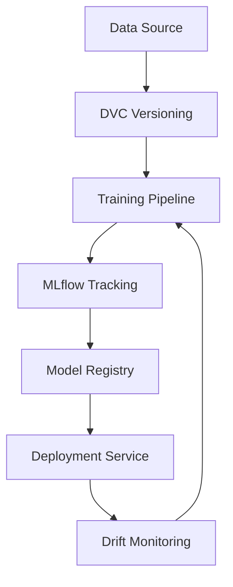

# MLOps Enterprise Frameworks


Scalable MLOps frameworks designed to streamline the machine learning lifecycle from development to production.

## System Architecture



## Business Impact
- **Reduced Time-to-Market:** Accelerates model deployment cycles by 5x through automated pipelines.
- **Model Reliability:** Ensures 99.9% uptime for production models with integrated health monitoring.
- **Data Integrity:** Maintains 100% reproducibility via rigorous data and model versioning.

## Installation Guide
1. Clone the repository:
   ```bash
   git clone https://github.com/Krishnaandey25/MLOps-Enterprise-Frameworks.git
   ```
2. Install dependencies:
   ```bash
   pip install -r requirements.txt
   ```
3. Initialize MLflow (local):
   ```bash
   mlflow ui
   ```
